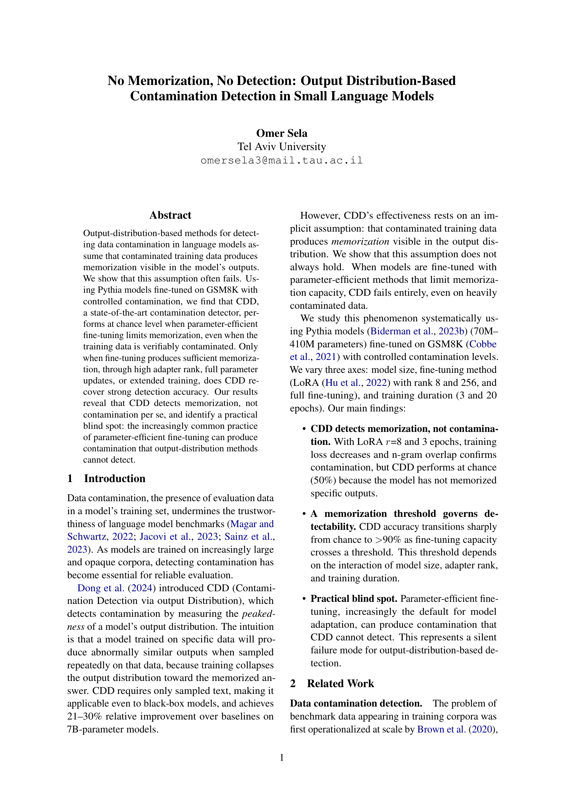

<p align="center">
  <a href="paper.pdf">
    
  </a>
</p>

<p align="center">
  <a href="paper.pdf"><strong>Read the full paper (PDF)</strong></a>
</p>

---

## Overview

This project studies how CDD (Contamination Detection via output Distribution) from [Dong et al. (ACL Findings 2024)](https://arxiv.org/abs/2402.15938) behaves on small language models (70M-410M parameters). We investigate the relationship between fine-tuning capacity, memorization, and CDD's ability to detect data contamination.

Using the Pythia model suite fine-tuned on GSM8K with controlled contamination levels, we systematically vary model size, fine-tuning method (LoRA r=8, LoRA r=256, full fine-tuning), and training duration (3 and 20 epochs) across 72 experimental conditions.

## Setup

```bash
# Create conda environment
conda env create -f environment.yml        # CPU
conda env create -f environment_gpu.yml    # GPU (CUDA 12.4)
```

## Project Structure

```
contamination_detection/    # Core library
  data/                     # Data loading, splitting, formatting, contamination
  detection/                # CDD: sampler, edit distance, peakedness, classifier
  training/                 # Model loading (LoRA + full), fine-tuning
  baselines/                # Random, perplexity, n-gram baselines
  evaluation/               # Metrics, confidence intervals, significance tests
  visualization/            # Plotting utilities
  analysis/                 # Scale analysis

configs/                    # Hydra configuration files
tests/                      # Unit tests
```

## Models and Dataset

- **Models**: Pythia-70M, Pythia-160M, Pythia-410M (EleutherAI)
- **Dataset**: GSM8K (500 examples: 300 train, 100 contamination, 100 evaluation)
- **Fine-tuning**: LoRA r=8, LoRA r=256, full fine-tuning; 3 and 20 epochs
- **Contamination levels**: 0, 1, 5, 10 repetitions of leaked data

## References

- Dong et al. "Generalization or Memorization: Data Contamination and Trustworthy Evaluation for Large Language Models." Findings of ACL 2024.
- Biderman et al. "Pythia: A Suite for Analyzing Large Language Models Across Training and Scaling." ICML 2023.
- Cobbe et al. "Training Verifiers to Solve Math Word Problems." arXiv:2110.14168.
- Hu et al. "LoRA: Low-Rank Adaptation of Large Language Models." ICLR 2022.
